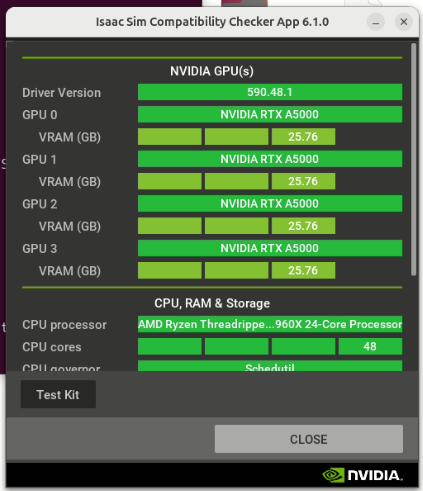
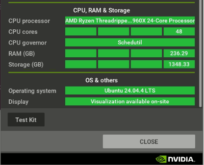
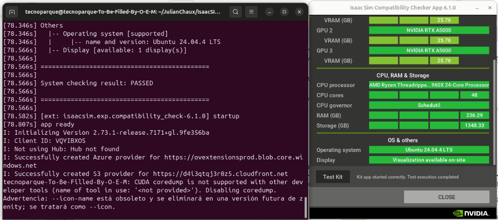
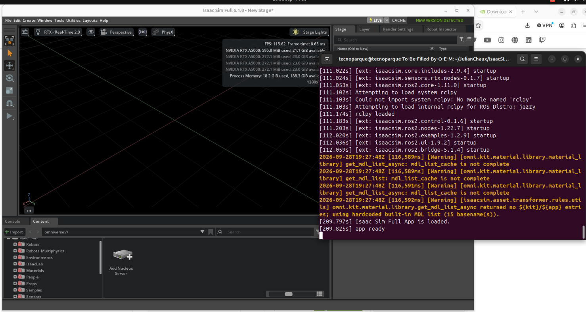

<div align="center">

# 🌐 Instalación de NVIDIA Isaac Sim 6.1.0
### Workstation / standalone en Ubuntu 24.04 LTS


[← Volver al README principal](../../../README.md)

</div>

---

Guía paso a paso para instalar **Isaac Sim 6.1.0 (Workstation / standalone)** en Ubuntu 24.04 LTS, verificar la compatibilidad del equipo y lanzar la aplicación por primera vez.

## Tabla de contenidos

- [Requisitos](#requisitos)
- [Verificación previa del sistema](#verificación-previa-del-sistema)
- [Descarga e instalación](#descarga-e-instalación)
- [Compatibility Checker](#compatibility-checker)
- [Primer arranque de Isaac Sim](#primer-arranque-de-isaac-sim)
- [Lanzador en el menú de Ubuntu (opcional)](#lanzador-en-el-menú-de-ubuntu-opcional)
- [Mensajes normales en la terminal](#mensajes-normales-en-la-terminal)
- [Solución de problemas](#solución-de-problemas)
- [Archivos de esta guía](#archivos-de-esta-guía)
- [Referencias oficiales](#referencias-oficiales)

---

## Requisitos

| Requisito | Detalle |
|---|---|
| 💻 Sistema operativo | Ubuntu **22.04 o 24.04 LTS** (x86_64) |
| 🎮 GPU | NVIDIA **RTX** con driver propietario instalado |
| 🧮 CPU | 16 o más hilos recomendados |
| 💾 RAM | 32 GB mínimo (64 GB o más recomendados) |
| 💽 Disco | Al menos 50 GB libres |
| 📦 Herramientas | `unzip` instalado |

Si falta el driver NVIDIA:

```bash
sudo ubuntu-drivers install
sudo reboot
nvidia-smi        # debe listar las GPUs y la versión del driver
```

> Probado en: Ubuntu 24.04.4 LTS · AMD Ryzen Threadripper (48 hilos) · 236 GB RAM · 4× NVIDIA RTX A5000 (24 GB) · Driver NVIDIA 590.48.1

---

## Verificación previa del sistema

Esta guía incluye un script que revisa el sistema operativo, las GPUs, la CPU, la RAM, el disco y las herramientas necesarias:

```bash
chmod +x scripts/*.sh
./scripts/check_prereqs.sh
```

**✅ Comprobación:** todas las líneas deben salir como `[OK]`. Un `[AVISO]` no impide la instalación, pero indica que el rendimiento puede ser menor al recomendado.

---

## Descarga e instalación

### Descargar

Descarga el paquete **Linux x86_64** desde la [página de descargas](https://docs.isaacsim.omniverse.nvidia.com/6.1.0/installation/download.html). Quedará en `~/Downloads`:

```
isaac-sim-standalone-6.1.0-linux-x86_64.zip
```

### Instalar (manual)

```bash
mkdir ~/isaacsim
cd ~/Downloads
unzip "isaac-sim-standalone-6.1.0-linux-x86_64.zip" -d ~/isaacsim
cd ~/isaacsim
./post_install.sh
```

`post_install.sh` crea el enlace simbólico a `extension_examples`, que usan los tutoriales.

### Instalar (con script)

```bash
./scripts/install_isaac_sim.sh
# o con rutas personalizadas:
./scripts/install_isaac_sim.sh ~/Downloads/isaac-sim-standalone-6.1.0-linux-x86_64.zip ~/isaacsim
```

**✅ Comprobación:**

```bash
ls ~/isaacsim | grep -E "isaac-sim.sh|isaac-sim.compatibility_check.sh|post_install.sh"
```

Deben aparecer los tres archivos.

> ℹ️ El zip **no crea un acceso directo en el escritorio**. Isaac Sim se lanza desde la terminal o con el lanzador de la [sección de lanzador](#lanzador-en-el-menú-de-ubuntu-opcional).

---

## Compatibility Checker

El Compatibility Checker es una extensión ligera que verifica si el equipo cumple los requisitos para ejecutar Isaac Sim.

### Ejecutar

**Opción A: desde la instalación Workstation (la que usamos aquí)**

```bash
cd ~/isaacsim
./isaac-sim.compatibility_check.sh
```

**Opción B: con pip, sin instalar Isaac Sim completo**

```bash
python3 -m venv ~/isaacsim-env
source ~/isaacsim-env/bin/activate
pip install --upgrade pip
pip install "isaacsim[compatibility-check]" --extra-index-url https://pypi.nvidia.com
isaacsim isaacsim.exp.compatibility_check
```

> ⚠️ Los paquetes pip de Isaac Sim exigen una versión concreta de Python. Consulta la [guía de pip](https://docs.isaacsim.omniverse.nvidia.com/6.1.0/installation/install_python.html) y, si no coincide con la de tu sistema, crea el entorno con `uv` o `conda`. La primera vez pide aceptar el EULA: responde `Yes`.

**Opción C: con Docker (requiere NVIDIA Container Toolkit)**

```bash
# Sin interfaz gráfica
docker run --entrypoint bash -it --gpus all --rm --network=host \
  nvcr.io/nvidia/isaac-sim:6.1.0 ./isaac-sim.compatibility_check.sh --/app/quitAfter=10 --no-window

# Con interfaz gráfica
xhost +local:
docker run --entrypoint bash -it --gpus all --rm --network=host \
  -e "PRIVACY_CONSENT=Y" -v $HOME/.Xauthority:/isaac-sim/.Xauthority -e DISPLAY \
  nvcr.io/nvidia/isaac-sim:6.1.0 ./isaac-sim.compatibility_check.sh
```

### Interpretar los colores

| Color | Significado |
|---|---|
| 🟩 Verde | Excelente |
| 🟢 Verde claro | Bueno |
| 🟧 Naranja | Suficiente, pero se recomienda más |
| 🟥 Rojo | Insuficiente o no soportado |

### Resultado obtenido

**GPUs y driver:** las 4 RTX A5000 salen en verde claro por los ~25.8 GB de VRAM. El verde oscuro se reserva para GPUs de 32 GB o más.



**CPU, RAM, almacenamiento y sistema operativo:** todo en verde.



### Test Kit

Pulsa el botón **Test Kit**. Lanza una app mínima de Kit en modo headless para comprobar que el motor de Isaac Sim realmente se ejecuta.

**✅ Comprobación:**

- En la terminal aparece `System checking result: PASSED`.
- Junto al botón aparece `Kit app started correctly. Test execution completed`.



Cierra el checker con **CLOSE**.

---

## Primer arranque de Isaac Sim

```bash
cd ~/isaacsim
./isaac-sim.sh
```

- El **primer arranque tarda entre 5 y 10 minutos** porque compila el caché de shaders. En nuestra prueba, la app estuvo lista en unos 210 s. Los siguientes arranques son más rápidos.
- Para arrancar con una configuración limpia: `./isaac-sim.sh --reset-user`.

**✅ Comprobación:** en la terminal debe aparecer:

```
Isaac Sim Full App is loaded.
app ready
```

Y en la ventana **Isaac Sim Full 6.1.0**:

- Viewport con cuadrícula y un contador de FPS (en nuestra prueba, ~115 FPS con RTX Real-Time 2.0)
- Todas las GPUs listadas en la superposición de estadísticas
- El panel **Content** muestra la librería de assets (Robots, Environments, IsaacLab, Materials…)



### Prueba rápida

1. En el panel **Content**, abre **Robots**.
2. Arrastra un robot (por ejemplo, Franka o Carter) al viewport.
3. Pulsa **Play** (▶ en la barra izquierda) y comprueba que la simulación corre.

Siguiente paso: los [tutoriales Quickstart](https://docs.isaacsim.omniverse.nvidia.com/6.1.0/introduction/quickstart_index.html).

---

## Lanzador en el menú de Ubuntu (opcional)

El script crea dos entradas en el menú de aplicaciones: **Isaac Sim 6.1** y **Isaac Sim Compatibility Checker**.

```bash
./scripts/create_desktop_launcher.sh ~/isaacsim
```

Busca "Isaac Sim" con la tecla **Super**. Si haces clic derecho y eliges **Añadir a favoritos**, quedará anclado en el dock.

Si prefieres crearlo a mano, el archivo `~/.local/share/applications/isaac-sim.desktop` debe contener:

```ini
[Desktop Entry]
Type=Application
Name=Isaac Sim 6.1
Exec=/home/USUARIO/isaacsim/isaac-sim.sh
Path=/home/USUARIO/isaacsim
Terminal=true
Icon=applications-science
Categories=Development;
```

> `Terminal=true` abre una terminal para ver los logs mientras carga. Cámbialo a `false` si no la necesitas.

---

## Mensajes normales en la terminal

Estos mensajes **no son errores** y pueden ignorarse:

| Mensaje | Explicación |
|---|---|
| `Not using Hub: Hub not found` | Hub Workstation Cache es opcional. |
| `CUDA coredump is not supported ... Disabling coredump` | Solo desactiva los volcados de memoria de depuración. |
| `Advertencia: --icon-name está obsoleto ...` | Aviso de `zenity`, el programa de diálogos de Ubuntu. |
| `Could not import system rclpy` → `Attempting to load internal rclpy for ROS Distro: jazzy` → `rclpy loaded` | No hay ROS 2 en el sistema, así que usa su ROS 2 Jazzy interno. El bridge funciona igual. |
| `[Warning] ... mdl_list_cache is not complete` | Normal en el primer arranque, mientras se construye el caché de materiales. |
| `CACHE: NEW VERSION DETECTED` (esquina superior derecha) | Aviso sobre el caché opcional (Hub). |
| `Add Nucleus Server` en el panel Content | Nucleus ya no es necesario para usar Isaac Sim. |

> 💡 Para comunicarte con nodos ROS 2 externos, instala **ROS 2 Jazzy**, la versión que corresponde a Ubuntu 24.04.

---

## Solución de problemas

| Problema | Solución |
|---|---|
| `nvidia-smi: command not found` | Instala el driver: `sudo ubuntu-drivers install` y reinicia. |
| La ventana se queda en negro varios minutos | Es normal en el primer arranque (compilación de shaders). Espera hasta ver `app ready`. |
| Errores extraños de caché o configuración | Arranca con `./isaac-sim.sh --reset-user` o ejecuta `./clear_caches.sh`. |
| Conflicto entre la instalación pip y la standalone | Usa entornos separados y ejecuta `./clear_caches.sh`. |
| Rojo en *Driver Version* en el checker | Actualiza el driver NVIDIA a la versión que indica la página de requisitos. |

---

## Archivos de esta guía

Scripts e imágenes usados en esta guía, dentro de `docs/isaac_sim/isaac-sim-ubuntu24/`:

```
docs/isaac_sim/isaac-sim-ubuntu24/
├── isaac-sim-6.1.0.md
├── images/
│   ├── 01-checker-gpus.png
│   ├── 02-checker-cpu-os.png
│   ├── 03-checker-passed-testkit.png
│   └── 04-isaac-sim-running.png
└── scripts/
    ├── check_prereqs.sh            # Verifica los requisitos del sistema
    ├── install_isaac_sim.sh        # Descomprime y ejecuta post_install.sh
    └── create_desktop_launcher.sh  # Crea los lanzadores en el menú de Ubuntu
```

---

## Referencias oficiales

| Recurso | Enlace |
|---|---|
| Instalación Workstation | https://docs.isaacsim.omniverse.nvidia.com/6.1.0/installation/install_workstation.html |
| Requisitos del sistema | https://docs.isaacsim.omniverse.nvidia.com/6.1.0/installation/requirements.html |
| Descarga (Latest Release) | https://docs.isaacsim.omniverse.nvidia.com/6.1.0/installation/download.html |
| Instalación con pip | https://docs.isaacsim.omniverse.nvidia.com/6.1.0/installation/install_python.html |
| Assets locales | https://docs.isaacsim.omniverse.nvidia.com/6.1.0/installation/accessing_assets.html |
| FAQ / scripts de lanzamiento | https://docs.isaacsim.omniverse.nvidia.com/6.1.0/installation/install_faq.html |
| Tutoriales de inicio (Quickstart) | https://docs.isaacsim.omniverse.nvidia.com/6.1.0/introduction/quickstart_index.html |
| Código fuente en GitHub | https://github.com/isaac-sim/IsaacSim |

*Isaac Sim es software de NVIDIA sujeto a su propia licencia.*

---

*Probado en Ubuntu 24.04.4 LTS · Isaac Sim 6.1.0 · Septiembre 2026*

---

<div align="center">

[← Volver al README principal](../../../README.md)

</div>
